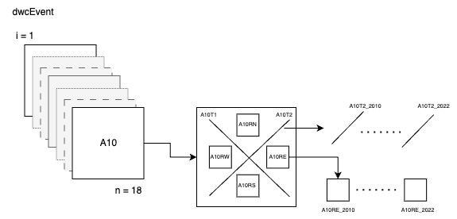

```{r setup, include=FALSE}
knitr::opts_chunk$set(echo = TRUE)
options(tidyverse.quiet = TRUE)
```


```{r}
library(targets)
library(DT)
library(knitr)
```


## Esquema de Eventos



En primer lugar se preparan los datos de los eventos. Tenemos eventos espaciales (sin componente temporal: parcelas, subplot y transectos), y eventos espacio-temporales (eg. visitas en distintos momentos a diferentes transectos). 

### Preparación de datos auxiliares (espaciales)

El esquema de trabajo que realizamos es el siguiente

```{r, echo=FALSE, warning=FALSE}
tar_visnetwork(names = c(
  contains("geo"), 
  contains("wkt"), 
  contains("spat"),
  contains("aux"),
  "event_dic"), 
  exclude = c(contains("occ"), 
              contains("taxonomy"),
              starts_with("print_sql"),
              contains("report"),
              contains("abundance"),
              contains("taxa"),
              "read_transects_data",
              "genera_emof_transects",
              "genera_event_transects",
              "prepare_transects",
              "parameters_transects",
              "prepare_variables_dicc", 
              "sql_abundance",
              "mapped"
    
  ),
  
  shortcut = FALSE, targets_only = FALSE)
```

- Tenemos diferentes archivos en formato shapefile (`geo*`), y mediante una función extraemos la componente espacial como formato `WKT`. Se generan tres objetos wkt (uno para parcelas, otro para transectos y otro para subplots)
- Utilizamos otra función (`event_spatial`) que añade el tipo de tratamiento a los objetos wkt
- Seguidamente con la 


## Parcelas event 
```{r, echo=FALSE}
tar_load(event_parcelas_aux)
event_parcelas_aux |> 
  dplyr::select(-parcela) |> 
  DT::datatable(
              rownames = FALSE,
              filter = 'top',
              options = list(
                pageLength = 20, 
                autoWidth = TRUE
              ))
```

## Subplots event 
```{r}
tar_load(event_subplot_aux)
event_subplot_aux |> 
  dplyr::select(-parcela) |> 
  DT::datatable(
              rownames = FALSE,
              filter = 'top',
              options = list(
                pageLength = 20, 
                autoWidth = TRUE
              ))
```


## Eventos procedentes de los transectos 

```{r}

```

